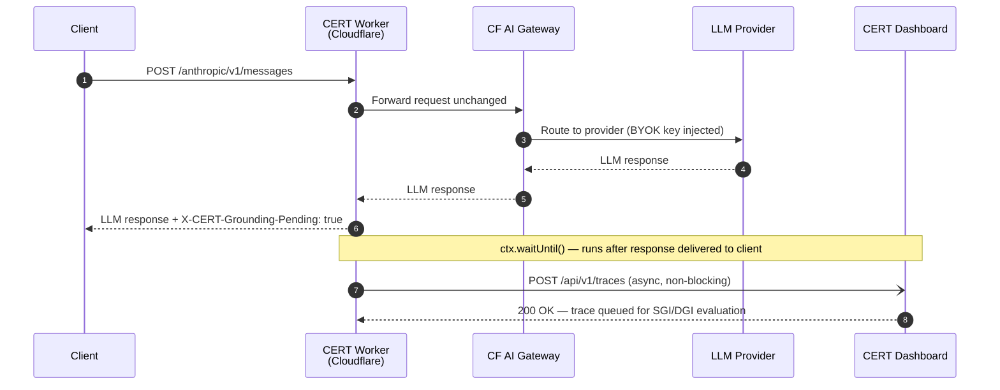

<div align="center">

  
</div>

<div align="center">
  


</div>

# CERT + Cloudflare AI Gateway

Cloudflare Worker that adds hallucination detection to every LLM call 
via Cloudflare AI Gateway. Uses `ctx.waitUntil()` to log traces to CERT 
asynchronously — zero latency added to the LLM response.


## How it works


## Prerequisites

1. A [CERT account](https://cert-framework.com) and API key
2. A Cloudflare account with AI Gateway enabled
3. An AI Gateway created at: Cloudflare Dashboard → AI → AI Gateway

## Deploy

```bash
npm install
wrangler secret put CERT_API_KEY       # from cert-framework.com/account
wrangler secret put CF_ACCOUNT_ID      # from your Cloudflare gateway URL
wrangler secret put CF_GATEWAY_ID      # the gateway slug (e.g. cert-demo)
wrangler deploy
```

Verify deployment:
```bash
curl https://cert-gateway.{your-subdomain}.workers.dev/health
# {"status":"ok","version":"0.1.0"}
```

## Authentication

This worker uses Cloudflare AI Gateway's BYOK (Bring Your Own Key) mode.

**Step 1** — Store your provider API key in CF AI Gateway:
Dashboard → AI → AI Gateway → {your-gateway} → Provider Keys → Add

**Step 2** — Create a gateway access token:
Dashboard → AI → AI Gateway → {your-gateway} → Overview → Create a token

**Step 3** — Use the gateway token (not the provider key) in requests:

```bash
curl -X POST https://cert-gateway.{your-subdomain}.workers.dev/anthropic/v1/messages \
  -H "Content-Type: application/json" \
  -H "cf-aig-authorization: Bearer {gateway-token}" \
  -H "anthropic-version: 2023-06-01" \
  -d '{
    "model": "claude-haiku-4-5-20251001",
    "max_tokens": 256,
    "messages": [{"role": "user", "content": "What is the capital of France?"}]
  }'
```

## Supported providers

Route to any provider Cloudflare AI Gateway supports:

| Provider  | Path prefix         |
|-----------|---------------------|
| Anthropic | `/anthropic/v1/...` |
| OpenAI    | `/openai/v1/...`    |
| Google    | `/google/v1/...`    |

## What you get

Every successful LLM call appears in the CERT dashboard with:
- **DGI score** for context-free responses (no RAG)
- **SGI score** for grounded responses (system prompt contains `Context:`)
- Response Quality (https://cert-framework.com/docs/quality-metrics)
- Provider, model, latency, and evaluation status

Response headers on every proxied call:
- `X-CERT-Grounding-Pending: true` — trace queued for evaluation
- `X-CERT-Project: {project-name}` — which CERT project received the trace

## Dashboard

- [CERT Dashboard](https://cert-framework.com)

## Research

- [A Geometric Taxonomy of Hallucinations in LLMs](https://arxiv.org/pdf/2602.13224)
- [How Transformers Reject Wrong Answers: Rotational Dynamics of Factual Constraint Processing](https://arxiv.org/abs/2603.13259)
- [Semantic Grounding Index: Geometric Bounds on Context Engagement in RAG Systems](https://arxiv.org/abs/2512.13771)

